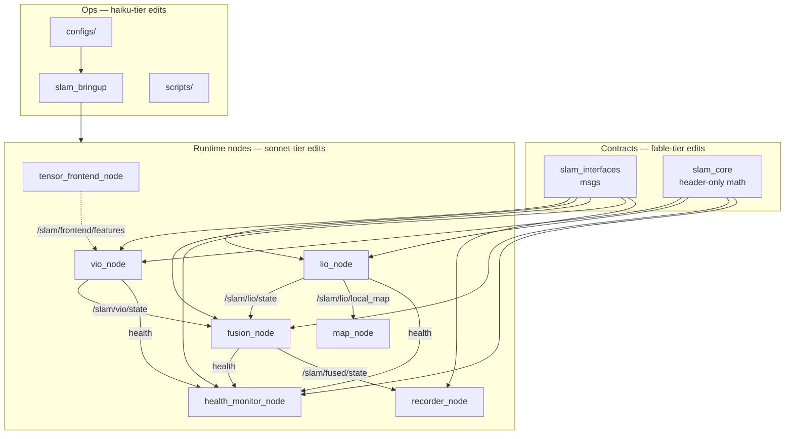
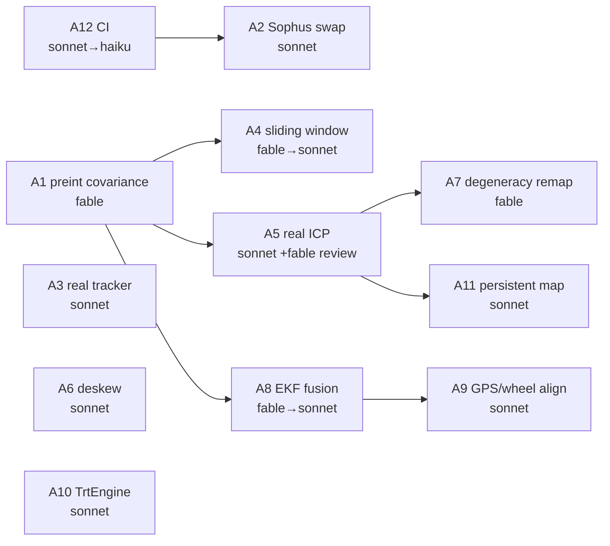

# Code graph

Human-readable view of `code_graph.json` (that file is the machine-readable
source of truth for delegation — components, edit tiers, activity definitions).

## Package dependency graph

Tier markings are defaults per package; `sub_tiers` in the JSON override them
per file (e.g. `sliding_window_estimator.hpp` inside sonnet-tier `vio_node` is
fable, because it is estimator math).

## Activity dependency graph

Independent lanes (`A3`, `A6`, `A10`, `A12`) can run as parallel cheap-model
delegations today; the `A1` fanout is the fable-gated critical path.

## Reading order for a new session

1. `STATE.md` — where things stand.
2. This file — what depends on what.
3. The contract header(s) of your target component (each placeholder file
   marks its extension point with `EXTENSION POINT:` / `TODO(...)` comments).
